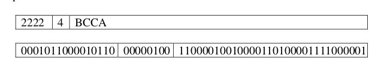
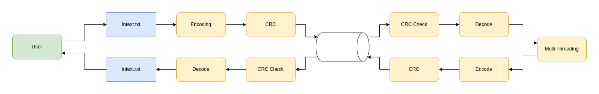
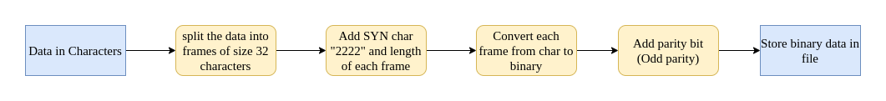
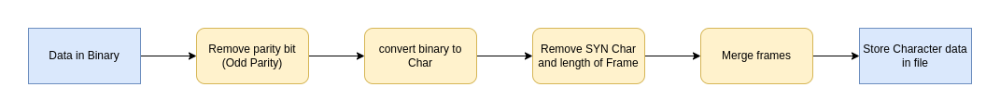
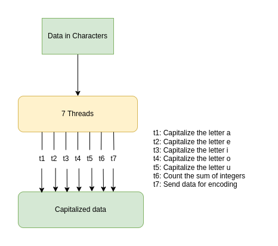
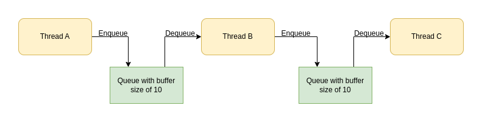
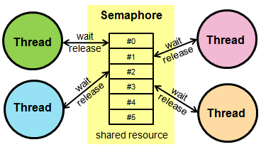
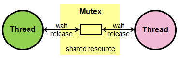

# **Client Server Application**

## **Description:**
The main idea of the project is to develop a data processing system to process strings of characters. The result must replace all instances of lowercase vowels with uppercase ones and append to the last set of strings the sum of all numbers found. Fork and exec system calls are used to create processes and also to exec system call is used to move execution between the processes. The communication between the client and server is done by using sockets. Multithreading is used to convert the lowercase vowels to uppercase and to count the number of integers in the data. For concurrent execution of 7 threads semaphore and mutex are used to control access to shared memory. 

### **File structure:**
1. The physical layer contains routines to handle tasks such as
   1. converting a character into a binary bit pattern
   2. converting binary patterns into characters,
   3. including a parity bit, and
   4. checking and removing the parity bit.

2. The data link layer contains routines for
   1. framing (putting two SYN characters, a LENGTH character, and data into a frame), and
   2. deframing (separating control characters from data characters).

        Example:
        
       

3. Client:   
   * This file helps to connect with the server. Client-side socket code is written in this file.

4. main:
   *    It is the main file of the entire project. It helps to route between the file on the client side. It takes input from the user. CRC is done in this file while binary data is sent to the server and also while receiving the data from the server.

5. server:
	* This file help to connect with the client using the port number and IP address. server-side socket program is written in this file.

6. Receiver:
	* CRC, encoding, decoding, and creation of threads for converting lowercase vowels to uppercase all these tasks are done by the receiver file.  

### ***System calls:***
* Fork:
	* Fork system call is used for creating a new process, which is called child process, which runs concurrently with the process that makes the fork() call (parent process). After a new child process is created, both processes will execute the next instruction following the fork() system call.
* Exec:
	* exec is a functionality of an operating system that runs an executable file in the context of an already existing process, replacing the previous executable.

 

## **Project Overview:**

 

### **Project data flow diagram:**
Below picture shows overview of entire project.

 

### **Encoding data flow diagram:**
Below picture shows data flow for encoding of data.

 

### **Decoding data flow diagram:**
Below picture shows data flow diagram for decoding of data.

  

### **Multi Threading:**

### Overview:

 

### Data transfer between threads:
 

 

### Semaphore:
A semaphore is a value in a designated place in operating system (or kernel) storage that each process can check and then change. Depending on the value that is found, the process can use the resource or will find that it is already in use and must wait for some period before trying again.

 

### Mutex:
Mutex ensures that only one thread has access to a critical section or data by using operations like a lock and unlock.

 

## **How to run the project:**
* To run this project any distribution of the Linux operating system should be installed in your system.

* Before running the project enter the input text in the ***intext.txt*** file.

* After entering the input text in the file then enter the below commands to run the project.
    
* First, we should run the server so, open a new terminal and run the below commands.

        gcc server.c -o server
        gcc receiver.c -o receiver -lpthread -lrt
        ./server
    ***The execl system call is used in the project, so don't change the execution file name while running the project. It throws an error if the file name changes.***
* After executing the above commands server is running in one terminal. Now we should run the client. 

* To run the client open a new terminal and run the below commands.
	
        gcc physical.c -o physical
        gcc dataLink -o dataLink
        gcc client.c -o client
        gcc main.c -o main
        ./main

* The output for the given text can be seen in the ***result.txt*** file or in the terminal.

